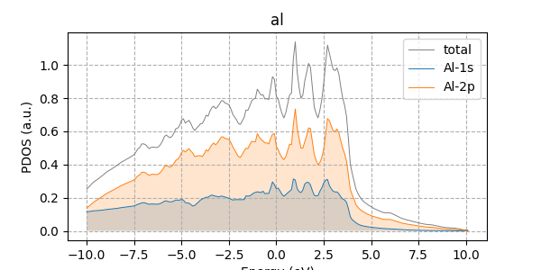
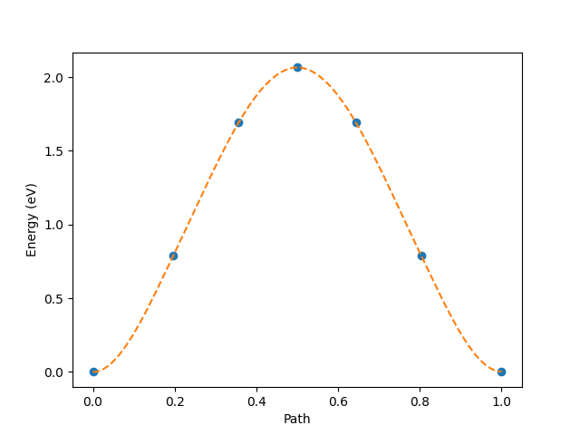

## xespresso
Quantum ESPRESSO Calculator for Atomic Simulation Environment (ASE).

For the introduction of ASE , please visit https://wiki.fysik.dtu.dk/ase/index.html


### Functions:
* Support all QE packages, including: pw, band, neb, dos, projwfc, pp ...
* Spin-polarized calculation
* LD(S)A+U
* Automatic submit job
* Automatic set up "nscf" calculation
* Read and plot dos, pdos and layer resolved pdos
* Plot NEB

### Author
* Xing Wang  <xingwang1991@gmail.com>

### Dependencies

* Python
* ASE
* numpy
* scipy
* matplotlib

### Installation using pip
pip install --upgrade --user xespresso

### Installation from source
You can get the source using git:
``` sh
git clone --depth 1 https://github.com/superstar54/xespresso.git
```

Add xespresso to your PYTHONPATH. On windows, you can edit the system environment variables.
``` sh
export PYTHONPATH="/path/to/xespresso":$PYTHONPATH
export ASE_ESPRESSO_COMMAND="/path/to/PACKAGE.x  PARALLEL  -in  PREFIX.PACKAGEi  >  PREFIX.PACKAGEo"
export ESPRESSO_PSEUDO="/path/to/pseudo"
```


### Examples

#### Automatic submit job

A example of setting parameters for the queue. See example/queue.py

``` python
queue = {'nodes': 4, 
         'ntasks-per-node': 20, 
         'partition': 'all', 
         'time': '23:10:00'}
calc = Espresso(queue = queue)
```


#### Automatic check a new calculation required or not

Before the calculation, first check the working directory. If the same geometry and parameters are used, try to check the results are available or not. Automatic check input parameters with Quantum Espresso document.

``` python
calc = Espresso(label = 'scf/fe')
```

#### Show debug information.

``` python
calc = Espresso(debug = True)
```

#### Add new species
Some atoms are special:
+ atoms with different starting_magnetization
+ atoms with different U values
+ atoms with special basis set

For example, Fe with spin state AFM. See example/spin.py

``` python
atoms.new_array('species', np.array(atoms.get_chemical_symbols(), dtype = 'U20'))
atoms.arrays['species'][1] = 'Fe1'
```

#### Setting parameters with "(i), i=1,ntyp"
Hubbard, starting_magnetization, starting_charge and so on. See example/dft+u.py

``` python
input_ntyp = {
'starting_magnetization': {'Fe1': 1.0, 'Fe2': -1.0},
'Hubbard_U': {'Fe1': 3.0, 'Fe2': 3.0},
}
input_data['input_ntyp'] = input_ntyp,
```

#### Setting parameters for "Hubbard_V(na,nb,k)"
Hubbard, starting_magnetization, starting_charge and so on. See example/dft+u.py

``` python
input_data = {
'hubbard_v': {'(1,1,1)': 4.0, '(3,3,1)': 1.0},
}
```

#### Control parallelization levels
To control the number of processors in each group: -ni,
-nk, -nb, -nt, -nd) are used.

``` python
calc = Espresso(pseudopotentials = pseudopotentials, 
                 package = 'pw',
                 parallel = '-nk 2 -nt 4 -nd 144',  # parallel parameters
                 }
```

#### Non self-consistent calculation

A example of nscf calculation following the above one.

``` python
# start nscf calculation
from xespresso.post.nscf import EspressoNscf
nscf = EspressoNscf(calc.directory, prefix = calc.prefix, 
                occupations = 'tetrahedra',
                kpts = (2, 2, 2),
                debug = True,
                )
nscf.run()
```

#### Calculate dos and pdos

A example of calculating and plotting the pdos from the nscf calculation.

``` python
from xespresso.post.dos import EspressoDos
# dos
dos = EspressoDos(parent_directory = 'calculations/scf/co',
            prefix = calc.prefix,
            Emin = fe - 30, Emax = fe + 30, DeltaE = 0.01)
dos.run()
# pdos
from xespresso.post.projwfc import EspressoProjwfc
projwfc = EspressoProjwfc(parent_directory = 'calculations/scf/co',
            prefix = 'co',
            DeltaE = 0.01)
projwfc.run()
```
<!--  -->

#### Calculate work function
``` python
calc.post(queue = queue, package = 'pp', plot_num = 11, fileout = 'potential.cube', iflag = 3, output_format=6)
calc.get_work_function()
```

#### Restart from previous calculation
``` python
calc.read_results()
atoms = calc.results['atoms']       
calc.run(atoms = atoms, restart = 1)
```

#### NEB calculation
See example/neb.py
``` python
from xespresso.neb import NEBEspresso
calc = NEBEspresso(
                 package = 'neb',
                 images = images,
                 climbing_images = [5],
                 path_data = path_data
                 )
calc.calculate()
calc.read_results()
calc.plot()
```



## Workflow
### Oxygen evolution reaction (OER) calculation

The workflow includes four modules: 
* OER_bulk
* OER_pourbaix
* OER_surface
* OER_site


The workflow can handle: 
* Generate surface slab model from bulk structure
* Determine the surface adsorption site
* Determine the surface coverage(*, O*, OH*), Pourbaix diagram
* Calculate the Zero-point energy


```python
oer = OER_site(slab,
               label = 'oer/Pt-001-ontop',
               site_type = 'ontop',
               site = -1,
               height=2.0,
	           calculator = parameters, 
               molecule_energies = molecule_energies,
               )
oer.run()
```

### To do lists:
* add `qPointsSpecs` and `Line-of-input` for phonon input file

